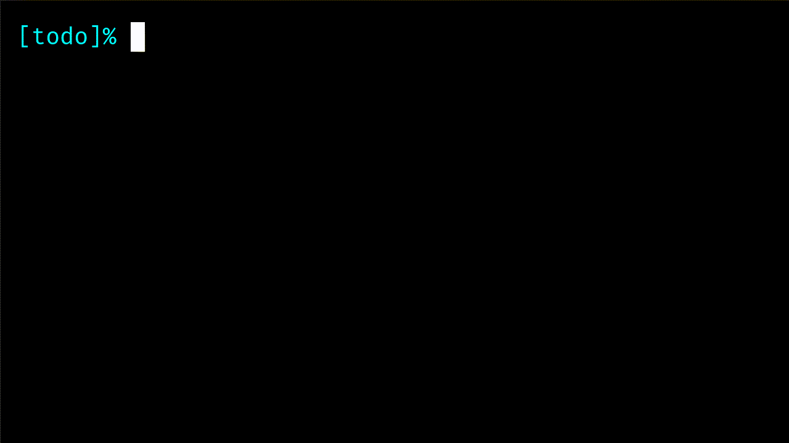

# vim-todo-plugin

A simple plugin which adds syntax highlighting and mappings to Vim for todo lists.

A todo file is any `.txt` file whose name contains (case insensitive) `todo` 
(for example, `hello_todo.txt` and `ToDo.txt` are both valid todo files).

## Installation

Copy all files into respective directories (make sure those directories exist first):

```
mkdir -p ~/.vim/ftdetect ~/.vim/syntax ~/.vim/ftplugin
cp vim-todo-plugin/ftdetect/todo.vim ~/.vim/ftdetect/todo.vim
cp vim-todo-plugin/syntax ~/.vim/syntax/todo.vim
cp vim-todo-plugin/ftplugin/todo.vim ~/.vim/ftplugin/todo.vim
```

## Syntax highlighting

This plugin highlights **sections** (prefixed by a `@` character) and 
**todo-elements** (prefixed by empty square brackets or square brackets with a 
`x` character inside).

If you want to change the default colors you can simply edit the `syntax/todo.vim`

## Default mappings

All mappings depend on your `localleader` key (please consult `:help maplocalleader`).

- `<localleader><localleader>`: insert a new section.
- `<localleader><CR>`: insert a new todo-element.
- `<localleader>m`: mark/unmark an element as done.
- `<localleader>d` (only in insert mode): insert the current date.

You can customize these mappings by editing `ftplugin/todo.vim`.

## Demonstration


